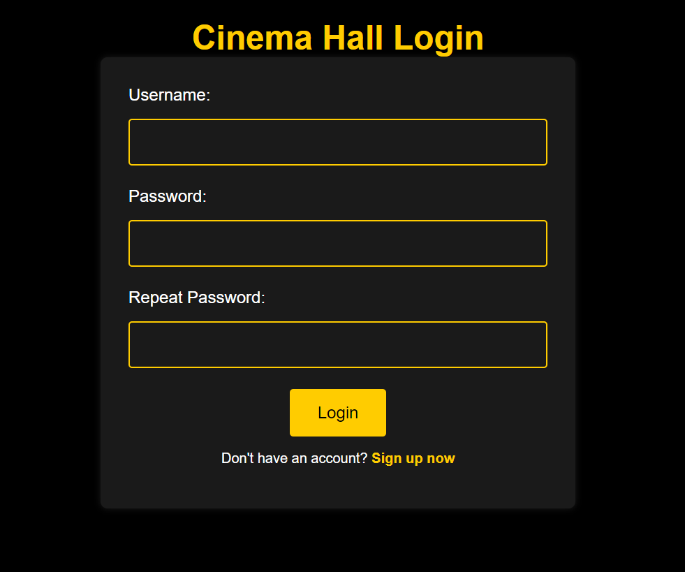

<p align="center">

</p>

<h1 align="center">Cinema-app</h1>

## :page_facing_up: Project description :page_facing_up:
```
This web application is built using the Spring framework and Hibernate ORM. 
It supports CRUD (Create, Read, Update, Delete) operations and is designed to work with a database.
Hibernate second level cache and Liquibase were used to improve performance and ensure stability.
The application has been tested and works locally on a computer.
```
## :heavy_check_mark: Features :heavy_check_mark:
+ **basic authentication like a user/admin** *http://localhost:8080/login*
+ **registration like a user** *http://localhost:8080/register*
+ **display user** *http://localhost:8080/users/by-email?email= (users email)*
+ **create cinema hall** *http://localhost:8080/cinema-halls*
+ **display all cinema halls** *http://localhost:8080/cinema-halls*
+ **create movie** *http://localhost:8080/movies*
+ **display all movies** *http://localhost:8080/movies*
+ **create movie session** *http://localhost:8080/movie-sessions*
+ **display available sessions** *http://localhost:8080/movie-sessions/available?movieId= (movie id)&date= (dd.MM.YYYY)*
+ **update movie session** *http://localhost:8080/movie-sessions/ (movie session id)*
+ **delete movie session** *http://localhost:8080/movie-sessions/ (movie session id)*
+ **create order** *http://localhost:8080/orders/complete*
+ **create order** *http://localhost:8080/orders/complete*
+ **display all orders by user** *http://localhost:8080/orders*
+ **add movie session to shopping cart** *http://localhost:8080/shopping-carts/movie-sessions?movieSessionId= (id)*
+ **display shopping cart by user** *http://localhost:8080/shopping-carts/by-user*
## :computer: Technologies used :computer:
+ Spring
+ Hibernate
+ Liquibase
+ Mysql 8.0.31
+ log4j
+ Junit5
+ Mockito
+ HSQLDB
## :wrench: Installation :wrench:
1. Install Tomcat 9.0.50. If you decide to install version 10 and above, you should use a different dependency for servlets and JSTL as well.
2. Make sure you have Mysql installed.
3. Clone the repository to your local machine.
4. In Edit configuration menu -> Add new configuration -> Tomcat server Local -> Configure -> Choose directory with your Tomcat installed -> press fix button in the lower right corner -> choose war exploded -> ok
5. Use init_db.sql file for creating your local database.
6. Open db.properties file from src\main\resources and write information about your database.Do the same in file liquibase.properties.
```
db.driver= "YOUR_DRIVER"
db.url= jdbc:mysql://YOUR_DATABASE_URL/cinema_app
db.user= "YOUR_USERNAME"
db.password= "YOUR_PASSWORD"
```
7. Press debug button.
____
After completing all the steps, your browser should show the login page at the address http://localhost:8080/login

# :point_up_2: Recommendations :point_up_2:
The application will save two roles ('USER' id = 1 and 'ADMIN' id = 2) and user with role ADMIN to database after start . 
You can see this data inside the DataInitializer class.
So you can use an email and a password of this user for authentication or you can register like a new user with role USER.
Don't forget that access to pages depends on your role. All permissions you can find inside the SecurityConfig class in method configure.
Also there you can find information about the methods(GET, POST, UPDATE or DELETE) that should be used for the page.
The application doesn't contains jsp or html pages, so the best way to send a request it's to use Postman application. 
